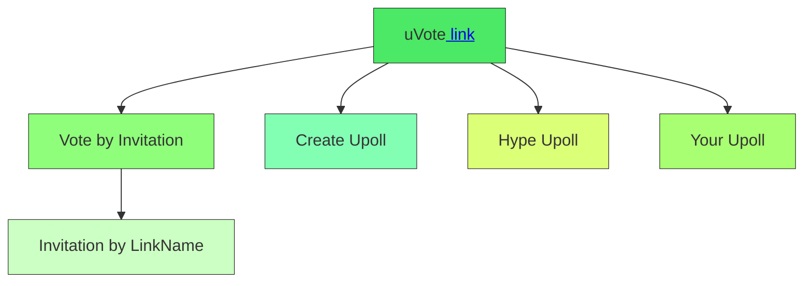

  

 

**https://uvote.github.io/**

 

## Introduction
uVote is a blockchain-based polling system that utilizes the security and transparency of blockchain technology to create trustworthy and verifiable polls, providing a truthful depiction of reality through real-time polls that can be verified by anyone.

## Features
* **Transparent Polls**: uVote uses blockchain technology to generate ballots that are completely clear and unassailable by fraudulent acts.
* **Real-time Verification**: Polls can be verified in real-time by anyone, ensuring the integrity of the voting process.
* **Nil Cost**: The use of blockchain technology allows for a practically nil cost, making it an efficient solution for polling.

## Getting Started
To get started with uVote, you can:
* **Vote by Invitation**: Participate in polls by invitation, using a unique link name.
* **Create Upoll**: Create your own poll and share it with others.
* **Hype Upoll**: Promote and raise awareness about existing polls.
* **Your Upoll**: Access and manage your own polls.

## How it Works
The uVote system can be navigated through the following flow:

## Benefits
* **Security**: Blockchain technology ensures the security and integrity of the voting process.
* **Transparency**: Polls are transparent and can be verified in real-time by anyone.
* **Efficiency**: The use of blockchain technology allows for a practically nil cost.

## Contribute
We welcome contributions to the uVote project.

## License
uVote is licensed under [MIT License].

## Credits

Thanks to our friend [@pedrovalido](https://github.com/pedrovalido) for suggestions regarding Solidity.
